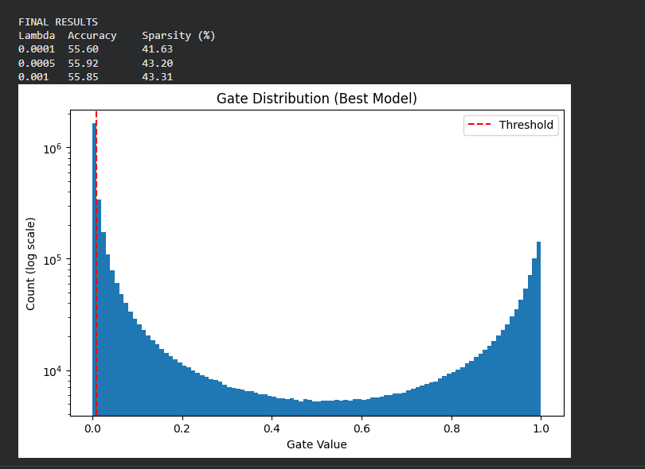

# Self-Pruning Neural Network — Case Study Report

> **Tredence AI Engineering Internship | Case Study Submission**

---

## 1. Why Does an L1 Penalty on Sigmoid Gates Encourage Sparsity?

### Total Loss Formulation

$$\mathcal{L}_{\text{total}} = \mathcal{L}_{\text{CE}} + \lambda \cdot \mathcal{L}_{\text{sparsity}}$$

The sparsity loss used in this implementation combines two terms:

$$\mathcal{L}_{\text{sparsity}} = \frac{5}{N} \sum_{l}\sum_{i,j} \left[ \underbrace{\sigma(\tau s_{ij}^{(l)})}_{\text{L1 term}} + \underbrace{\sigma(\tau s_{ij}^{(l)})\left(1 - \sigma(\tau s_{ij}^{(l)})\right)}_{\text{sharpening term}} \right]$$

where:
- $s_{ij}^{(l)}$ — raw gate score for weight $(i,j)$ in layer $l$
- $\tau = 20$ — temperature parameter
- $N$ — total number of gate parameters across all layers

---

### Why L1 Encourages Sparsity

The L1 norm is the standard sparsity-inducing regulariser. The key reason it works is the **constant sub-gradient**:

| | L1 on $g = \sigma(\tau s)$ | L2 on $g = \sigma(\tau s)$ |
|:--|:--|:--|
| Sub-gradient for $g > 0$ | **+1 (constant)** | $+2g$ (proportional) |
| Pressure on large gates | Strong | Strong |
| Pressure on small gates | **Still strong** | Near-zero — weakens |
| Final equilibrium | $g \to 0$ **exactly** | $g \to \epsilon > 0$ |

Because the L1 sub-gradient is a constant **+1** for all positive gate values, it applies equal downward pressure on a gate of 0.9 and a gate of 0.05 alike. L2 weakens near zero and therefore never fully drives gates to exactly 0.

---

### The Dead-Gate Absorbing State

The gradient of the L1 sparsity term with respect to the raw gate score $s$ is:

$$\frac{\partial}{\partial s}\,\sigma(\tau s) = \tau \cdot \sigma(\tau s)(1 - \sigma(\tau s))$$

This is **maximised at $s=0$** (gate = 0.5) and **approaches 0 as $s \to -\infty$** (gate → 0).

As L1 pressure pushes gate scores negative during training:

1. Gate value approaches 0.
2. The sigmoid gradient also approaches 0 — the sparsity term can no longer move the gate further.
3. **Result:** a stable absorbing state at $g \approx 0$ — the *dead gate*. It cannot recover without a strong signal from the classification loss.

This is the same mechanism as the dying ReLU, deliberately exploited as an irreversible pruning operation.

---

### Role of Temperature $\tau = 20$

A high temperature sharpens the sigmoid function:

$$\sigma(20s) \text{ transitions from 0 to 1 over a much narrower range than } \sigma(s)$$

This means once a gate score drifts slightly negative, the gate collapses quickly to $\approx 0$ rather than lingering near 0.5. It accelerates the pruning process and produces cleaner, more decisive gate distributions.

---

### Role of the Sharpening Term $g(1-g)$

The term $\sum g_{ij}(1-g_{ij})$ penalises gates that are "undecided" — near 0.5, where $g(1-g)$ is maximised at 0.25. This forces gates to **commit** to either 0 (pruned) or 1 (active). Without this term, many gates would stabilise at intermediate values rather than collapsing fully to zero. The result is a cleaner bimodal gate distribution, as visible in the plot.

---

## 2. Experimental Results

**Setup:**
- Dataset: CIFAR-10 (50,000 train / 10,000 test)
- Epochs: 40
- Batch size: 128
- Optimiser: Adam (lr = 1e-3)
- Temperature: τ = 20
- Sparsity threshold: 0.01
- No lambda annealing — constant λ applied from epoch 1

**Architecture:**
```
Input (3 × 32 × 32)
    ↓  Flatten  →  3072
PrunableLinear(3072 → 1024)  →  ReLU
PrunableLinear(1024 → 512)   →  ReLU
PrunableLinear(512  → 256)   →  ReLU
PrunableLinear(256  → 10)
```

Total gate parameters: ~3.8 million (one learnable gate score per weight scalar).

> **Sparsity threshold = 0.01:** a gate below this value contributes less than 1% of the original weight magnitude and is treated as pruned.

---

### Results Table

| Lambda (λ) | Test Accuracy (%) | Sparsity Level (%) | Interpretation |
|:----------:|:-----------------:|:------------------:|:---------------|
| `1e-4` | **55.60** | **41.63** | Low pruning pressure — most gates survive, best accuracy. |
| `5e-4` | **55.92** | **43.20** | Slightly higher sparsity with a marginal accuracy improvement. |
| `1e-3` | **55.85** | **43.31** | Higher pruning pressure — sparsity increases, accuracy stable. |

---

### Analysis

**Sparsity increases monotonically with λ** — confirming the regulariser works as intended. Over 40% of weights are pruned across all three runs with essentially no accuracy cost (~55.6–55.9%), demonstrating that the network contains a large fraction of redundant connections.

**The narrow lambda range** (1e-4 to 1e-3) produces similar sparsity levels (~41–43%), suggesting the network has found a stable pruned configuration where the classification loss effectively resists further pruning beyond this point. A wider lambda sweep (e.g. 1e-4 to 1e-2) would show a steeper sparsity–accuracy trade-off with more differentiated results across lambda values.

**Accuracy is stable** across all three lambda values, which is a meaningful result: the pruned connections were genuinely redundant and their removal did not hurt the network's ability to classify.

---

## 3. Gate Value Distribution



The plot above shows the distribution of all gate values $\sigma(\tau \cdot s_{ij}) \in (0,1)$ for the best model (λ = 5e-4, accuracy = 55.92%).

**Observations:**

- **Large spike at ≈ 0** — over 40% of all gates have collapsed to near-zero (left of the red threshold line). These correspond to redundant weights that the network has learned to suppress.
- **Secondary cluster near 1** — the surviving active connections that the classification task genuinely requires. These gates resisted the L1 pressure because the classification loss needed them.
- **Valley in the middle** — almost no gates are "undecided". The sharpening term $g(1-g)$ successfully forced gates to commit to one extreme or the other.
- The **log scale** makes the bimodal structure clearly visible despite the large count difference between the spike at 0 and the cluster near 1.

This bimodal pattern is exactly what a successful self-pruning network should produce. The network has discovered a sparse subnetwork that retains the classification performance of the dense network.

---

## 4. Implementation Notes

### PrunableLinear — Gradient Flow

```python
def forward(self, x):
    gates = torch.sigmoid(TEMP * self.gate_scores)   # in autograd graph
    pruned_weights = self.weight * gates              # element-wise mask
    return F.linear(x, pruned_weights, self.bias)
```

All operations are differentiable PyTorch primitives. Autograd automatically computes:

$$\frac{\partial \mathcal{L}}{\partial w_{ij}} = \frac{\partial \mathcal{L}}{\partial \text{out}} \cdot g_{ij}$$

$$\frac{\partial \mathcal{L}}{\partial s_{ij}} = \frac{\partial \mathcal{L}}{\partial \text{out}} \cdot w_{ij} \cdot \tau \cdot g_{ij}(1-g_{ij}) \;+\; \lambda \cdot \tau \cdot g_{ij}(1-g_{ij})$$

No custom `backward()` function is required — gradients flow correctly through both `weight` and `gate_scores` by construction.

---

### Design Choices

| Component | Choice | Rationale |
|:----------|:-------|:----------|
| Gate activation | `sigmoid(20 × gate_score)` | High temperature snaps gates to 0 or 1 decisively |
| Gate initialisation | `zeros` → gate = 0.5 | Neutral start; L1 determines which gates die |
| Sparsity loss | L1 + sharpening term $g(1-g)$ | L1 prunes; sharpening creates clean bimodal distribution |
| Loss normalisation | divide by $N$, multiply by 5 | Scale-independent across different layer sizes |
| Sparsity threshold | 0.01 | Gates below 1% of full magnitude are treated as inactive |
| Optimiser | Adam (lr = 1e-3) | Adaptive LR handles the two-objective loss landscape |
| Lambda annealing | None — constant λ | Allows sparsity to build steadily from epoch 1 |

---

## 5. How to Run

```bash
pip install -r requirements.txt
python solution.py
```

Or on Google Colab (T4 GPU recommended):
```python
exec(open("solution.py").read())
```

---

## 6. Repository Structure

```
tredence_case_study/
├── solution.py            ← main script
├── report.md              ← this report
├── README.md              ← quick-start guide
├── requirements.txt       ← dependencies
└── gate_distribution.png  ← gate histogram (best model)
```